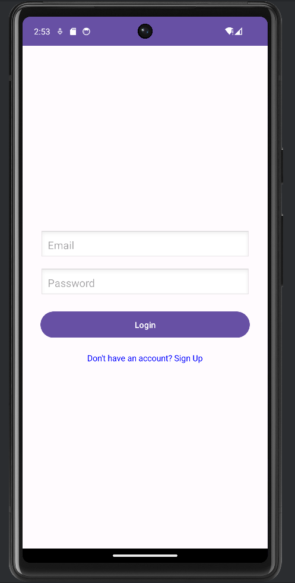
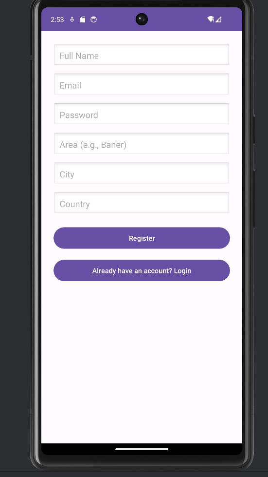
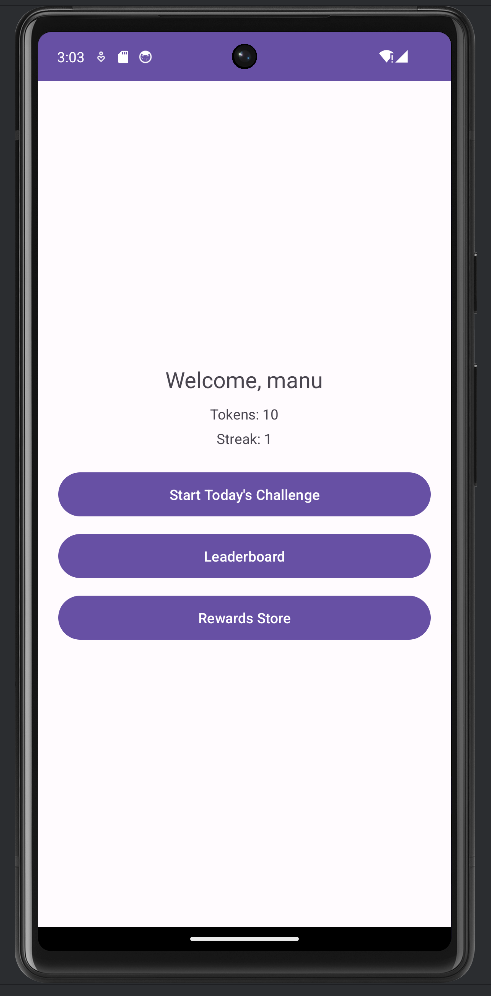
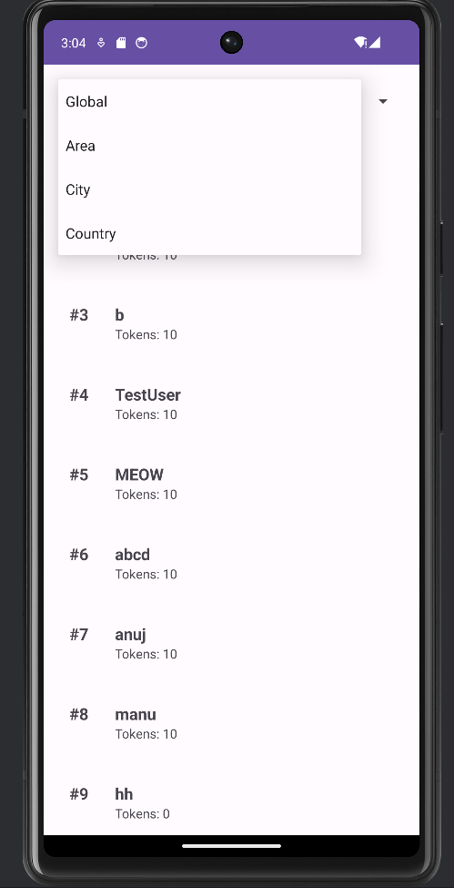
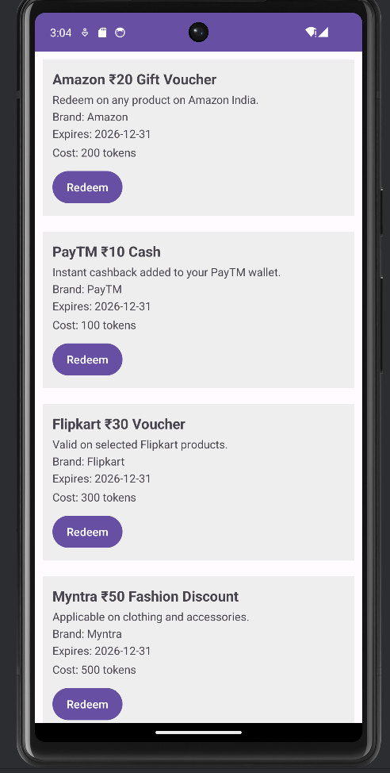
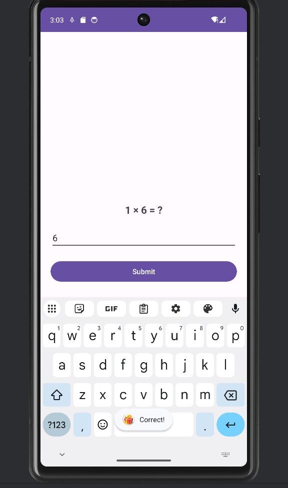

# 📱 Sharp Rewards

A full-stack **gamified daily challenge rewards platform** built with **Android (Java)**, **Node.js**, **Express**, and **MongoDB**.

The app allows users to register/login, solve daily challenges, earn tokens, maintain streaks, compete on leaderboards (global & location-based), and redeem rewards using earned tokens.

---

## 🚀 Features

### ✅ User Authentication
- Register/Login using email
- Password hashing with bcrypt
- JWT-based authentication
- Secure API access
- Logout support

### 🧠 Daily Challenge System
- New challenge every day
- Answer submission validation
- Auto-reset using cron jobs
- Streak tracking

### 🪙 Token & Rewards System
- Earn tokens for correct answers
- Streak-based incentives
- Redeem rewards using tokens
- Unique coupon generation
- Instant database update after redemption

### 🏆 Leaderboard System
- Today's leaderboard
- Global leaderboard (all-time tokens)
- Area-based leaderboard
- City-based leaderboard
- Country-based leaderboard
- Real-time ranking updates

### 📱 Android App UI
- Clean & responsive UI
- RecyclerView & Adapters
- Local data sync using SharedPreferences
- Retrofit + OkHttp + Gson integration

---

## 🛠 Tech Stack

| Layer | Technology |
|-------|-----------|
| Frontend | Android (Java) |
| Networking | Retrofit2, OkHttp, Gson |
| Backend | Node.js, Express.js |
| Database | MongoDB + Mongoose |
| Auth | JWT, bcrypt |
| Scheduler | Cron Jobs |
| Storage | SharedPreferences (Android) |

---

## 📁 Project Structure

```
SharpRewards/
│
├── backend/
│   ├── controllers/          # Business logic
│   ├── routes/               # API endpoints
│   ├── models/               # MongoDB schemas
│   ├── cron/                 # Daily reset jobs
│   ├── server.js             # Backend entry point
│   └── package.json
│
├── android-app/
│   ├── app/
│   │   └── src/
│   │       └── main/
│   │           └── java/
│   │               └── com/example/sharprewards/
│   │                   ├── activities/
│   │                   ├── adapters/
│   │                   ├── models/
│   │                   └── api/
│   │
│   ├── AndroidManifest.xml
│   └── build.gradle
│
└── assets/
    └── images/
        ├── login.png
        ├── signup.png
        ├── dashboard.png
        ├── leaderboard.png
        ├── redeemvouncher.png
        └── challenge.png
```

---

## 🔐 Environment Variables

Create a `.env` file inside the `backend` folder:

```env
JWT_SECRET=your_jwt_secret_here
MONGO_URI=mongodb://localhost:27017/sharprewards
```

> **Note:** MongoDB can be local or cloud-based (MongoDB Atlas).

---

## 🧪 How It Works

1. User registers and logs in via the Android app
2. Backend generates a daily challenge
3. User submits an answer
4. If correct:
   - Tokens are awarded
   - Streak is updated
5. Leaderboards update in real time
6. User redeems rewards using tokens
7. Daily challenge & leaderboard reset automatically via cron

---

## 📦 Installation

### Backend Setup

```bash
git clone https://github.com/anuj23awasthisharp-rewards.git
cd sharp-rewards/backend
npm install
```

Create `.env` file and start server:

```bash
node server.js
```

Backend runs at: `http://192.168.X.X:5000`

### Android App Setup

1. Open **Android Studio**
2. Select **Open Existing Project**
3. Choose the `android-app` folder
4. Update `RetrofitClient.java`:

```java
private static final String BASE_URL = "http://YOUR_LOCAL_IP:5000/";
```

5. Build and run the app on your device or emulator

---

## 🎥 Video Demo

Watch the complete walkthrough and explanation of Sharp Rewards:

[](https://drive.google.com/file/d/1GLVnk_W48drFsSm5eO6u70jbMSk37ztC/view?usp=sharing)


---

## 📚 Documentation

Complete project documentation including architecture, API endpoints, and implementation details:

[](https://drive.google.com/file/d/1QUeUf2wtLGNuaQgLSzfm9GMaNX0TL9Pf/view?usp=sharing)


---

## 📸 Preview

### 🔐 Login Screen


### 📝 Signup Screen


### 🏠 Dashboard


### 🏆 Leaderboard


### 🎁 Redeem Voucher


### 🧠 Daily Challenge


---

## ⚠️ Known Issues / To-Dos

- Rate limiting for API abuse prevention
- Push notifications for daily challenges
- Admin panel for challenge management
- Better reward recommendation logic

---

## 👨‍💻 Author

Made with 💻 by **ANUJ AWASTHI**  
📍 India

---

## 📄 License

This project is licensed under the **MIT License**.

---

## 🤝 Contributing

Contributions, issues, and feature requests are welcome!

Feel free to check the [issues page](https://github.com/anuj23awasthi/sharp-rewards/issues).

---

## ⭐ Show Your Support

Give a ⭐️ if this project helped you!
